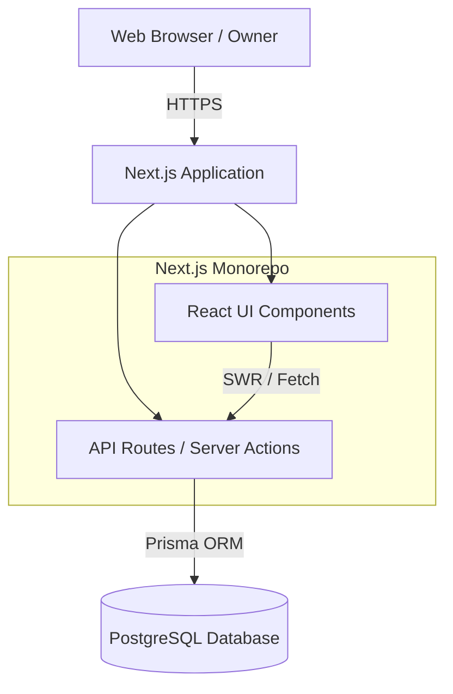

# Apartment Management System - Architecture & Design Document

## 1. System Overview
The Apartment Management System (AMS) is a web-based platform designed for apartment owners to efficiently manage their rental properties. It centralizes property data, automates utility calculations, and provides financial insights through a KPI dashboard. The system is designed to be scalable, supporting owners with multiple apartment buildings and varying pricing structures.

## 2. Technical Stack Recommendation

### Frontend (Client-Side)
*   **Framework**: **Next.js** (React)
    *   *Reason*: Excellent performance (Server-Side Rendering), SEO optimization, and unified architecture (frontend + backend).
*   **Language**: **TypeScript**
    *   *Reason*: Type safety is critical for financial calculations and maintaining business logic integrity.
*   **Styling**: **Vanilla CSS (Modern)**
    *   *Reason*: Maximum control over the "premium" aesthetic, lightweight, and creating a custom design system without framework lock-in.
*   **State Management**: React Context API + SWR (Server-side handling)
    *   *Reason*: SWR handles data fetching and caching optimally.

### Backend (Server-Side)
*   **Runtime**: **Next.js API Routes** (Node.js)
    *   *Reason*: Simplifies deployment (serverless ready) and keeps codebase unified.
*   **ORM**: **Prisma**
    *   *Reason*: Best-in-class type safety, easy migrations, and intuitive schema definition.

### Database
*   **Engine**: **PostgreSQL**
    *   *Reason*: Robust, relational integrity (essential for financial data), and scalable.

## 3. Database Schema (ERD)

The database consists of the following core entities:

### `Owner` (User)
*   `id`: UUID (PK)
*   `email`: String (Unique)
*   `password_hash`: String
*   `full_name`: String
*   `created_at`: DateTime

### `Apartment` (Building)
*   `id`: UUID (PK)
*   `owner_id`: UUID (FK -> Owner)
*   `name`: String (e.g., "Sunrise Residency")
*   `address`: String
*   `default_elec_price`: Float (per unit)
*   `default_water_price`: Float (per unit)
*   `created_at`: DateTime

### `Room`
*   `id`: UUID (PK)
*   `apartment_id`: UUID (FK -> Apartment)
*   `room_number`: String (e.g., "101", "A-20")
*   `floor`: Integer
*   `size_sqm`: Float
*   `base_rent`: Decimal(10, 2)
*   `status`: Enum ('OCCUPIED', 'VACANT', 'MAINTENANCE')
*   `tenant_name`: String (Optional, for simple tracking)
*   `created_at`: DateTime

### `UtilityReading` (Monthly Records)
*   `id`: UUID (PK)
*   `room_id`: UUID (FK -> Room)
*   `record_month`: Date (e.g., 2026-01-01)
*   `elec_meter_prev`: Float
*   `elec_meter_current`: Float
*   `water_meter_prev`: Float
*   `water_meter_current`: Float
*   `elec_usage`: Float (Computed)
*   `water_usage`: Float (Computed)
*   `total_cost`: Decimal (Computed)
*   `is_paid`: Boolean

## 4. System Architecture Diagram



## 5. User Flows

### Flow 1: Onboarding & Setup
1.  **Sign Up/Login**: Owner enters creds on a sleek, glassmorphism-styled login page.
2.  **Create Apartment**: Owner clicks "Add Property", inputs "Apartment Name", "Address", "Default Electricity Rate", "Default Water Rate".
3.  **Add Rooms**: 
    *   Manual: Owner clicks "Add Room", enters "Room 101", "Rent", "Status".
    *   Bulk (Optional future feature): "Add Rooms 101-110".

### Flow 2: Monthly Meter Recording
1.  Owner navigates to **"Utility Manager"** tab.
2.  Selects **Month** (e.g., January 2026).
3.  System displays list of active rooms.
4.  Owner inputs `Current Reading` for Water & Electricity for each room.
    *   *System auto-calculates*: (Current - Previous) * Rate = Cost.
5.  Owner saves. System generates "Pending Invoice" amount for each room.

### Flow 3: Dashboard & Insights
1.  Owner lands on **Dashboard**.
2.  **Visuals**:
    *   **Revenue Card**: Shows Total Rent + Utility Income.
    *   **Occupancy Donut Chart**: Active vs Vacant rooms.
    *   **Utility Trend Line Chart**: Electricity/Water usage over last 6 months.
    *   **Arrears**: List of unpaid rooms (if payment tracking is implemented).

## 6. Sample API (Pseudo-code)

```typescript
// GET /api/dashboard/kpi
export async function GET(req) {
  const session = await getSession(req);
  if (!session) return new Response("Unauthorized", { status: 401 });

  // 1. Calculate Occupancy
  const totalRooms = await db.room.count({ where: { ownerId: session.user.id }});
  const occupiedRooms = await db.room.count({ 
    where: { ownerId: session.user.id, status: 'OCCUPIED' }
  });
  const occupancyRate = (occupiedRooms / totalRooms) * 100;

  // 2. Calculate Revenue (Current Month)
  const currentMonthReadings = await db.utilityReading.aggregate({
    _sum: { total_cost: true },
    where: { 
      record_month: currentMonth,
      room: { ownerId: session.user.id }
    }
  });
  
  const totalRent = await db.room.aggregate({
    _sum: { base_rent: true },
    where: { ownerId: session.user.id, status: 'OCCUPIED' }
  });

  return Response.json({
    occupancyRate,
    revenue: {
      rent: totalRent._sum.base_rent,
      utilities: currentMonthReadings._sum.total_cost,
      total: totalRent._sum.base_rent + currentMonthReadings._sum.total_cost
    }
  });
}
```
